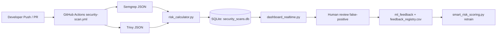

Shift-Left Sentinel: Automated DevSecOps Gate
Shift-Left Sentinel is a proactive security framework that integrates automated vulnerability scanning directly into the developer workflow. By analyzing code and dependencies during the Pull Request stage, it prevents high-risk vulnerabilities from ever reaching the main branch.

System Architecture
The system is organized into four modular layers that work in sequence:

1. Ingestion & Orchestration (Module 1)
Trigger: Automates security checks on every push and pull_request to the main branch.
Environment: Provisions an ephemeral Ubuntu container to ensure a clean, isolated scan environment for every run.

2. Detection & Analysis (Module 2)
SAST (Semgrep): Scans the src/ directory for logic flaws, such as hardcoded credentials or insecure API usage.
SCA (Trivy): Analyzes requirements.txt to identify known vulnerabilities (CVEs) in third-party libraries.
Telemetry: Both tools export results into raw JSON files for processing.

3. Intelligence & Risk Core (Module 3)
RWCS Algorithm: A Python-based engine (risk_engine.py) that parses the JSON telemetry.
Scoring: It calculates a weighted Risk Score (0-100) based on the severity and quantity of findings.

4. Enforcement Gate (Module 4)
Proactive Blocking: If the calculated Risk Score exceeds the threshold (80), the script exits with a failure code.
Gatekeeping: GitHub Actions interprets the exit code to physically block the merge, forcing developers to remediate risks before proceeding.

## Smart Risk Scoring (ML Upgrade)

A new module `src/smart_risk_scoring.py` introduces a scikit-learn `RandomForestClassifier` risk model.

### Features used by the model
- `code_churn` (int)
- `file_entropy` (float)
- `author_risk_score` (float)

### Output
The scorer returns:
- `risk_label` (`high` or `low`)
- `risk_probability` (probability of high risk, `0.0-1.0`)
- `confidence_score` (confidence in predicted label, `0.0-1.0`)

### Feedback loop / self-correction
`FeedbackLoop.retrain_model(commit_data, was_false_positive)` appends feedback to a local CSV registry and retrains the model so false-positive patterns are learned as low risk over time.

### Persistence
- Model is persisted to `smart_risk_model.pkl`.
- Feedback examples are stored in `feedback_registry.csv`.

### Minimal usage
```python
from src.smart_risk_scoring import SmartRiskScorer, FeedbackLoop

scorer = SmartRiskScorer(model_path="smart_risk_model.pkl")
feedback = FeedbackLoop(scorer, registry_path="feedback_registry.csv")

commit = {
    "code_churn": 140,
    "file_entropy": 5.2,
    "author_risk_score": 0.41,
}

result = scorer.predict_risk(commit)
print(result)

# Human marks flagged commit as false positive
feedback.retrain_model(commit, was_false_positive=True)
```


## Realtime Dashboard + Persistence Layer

The project now includes a SQLite-backed persistence layer and a realtime dashboard:
- `src/data_store.py` stores scan results, flagged commits, and ML feedback.
- `risk_calculator.py` persists each scan with git metadata and severity counts.
- `dashboard_realtime.py` visualizes live scan trends and supports false-positive feedback actions.


## Architecture Diagram (Current End-to-End)




## Run Full Demo Locally

```bash
./run_full_scan.sh
```

Helpful docs:
- `INSTALLATION.md`
- `README_DEMO.md`
- `.github/workflows/security-scan.yml`
